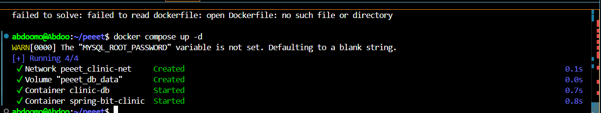
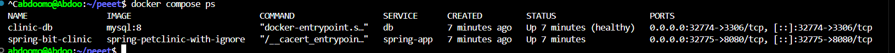
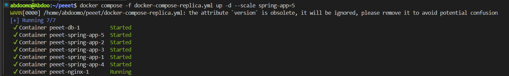
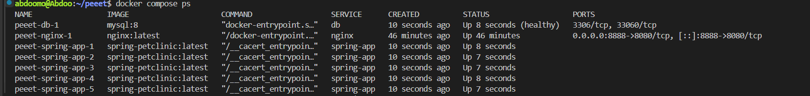
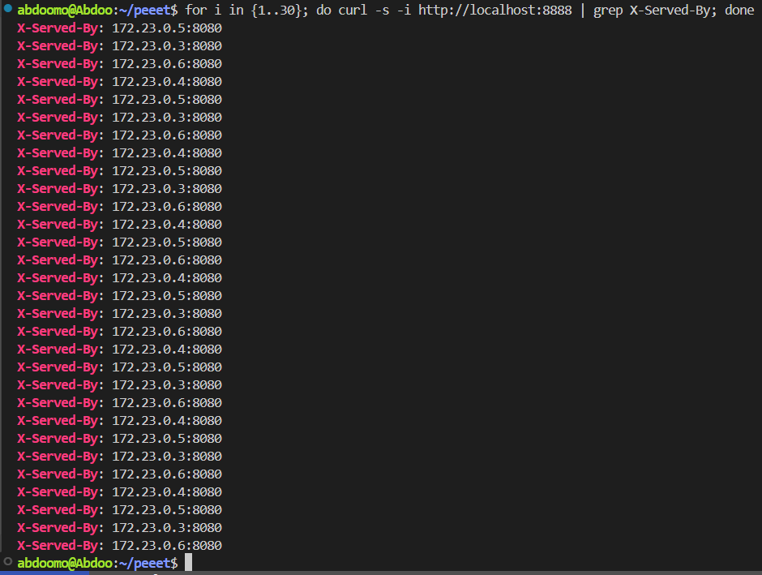

# DevOps Project: Docker & Container Orchestration

This project demonstrates the use of Docker Compose to manage and scale a multi-container application.

## Prerequisites
- Docker  
- Docker Compose  

---

## 1. Initial Deployment & Container Status
The first step involved running the Docker Compose setup. Despite a warning about a missing Dockerfile, the command successfully started the database container (`clinic-db`) and the application container (`spring-bit-clinic`).

```bash
docker compose up -d
```


---

## 2. Verifying the Running Containers
To check the status of all containers managed by the Docker Compose file, the following command was used:

```bash
docker compose ps
```
Purpose:

Confirms that both the database and application containers are running correctly.

Useful to verify if containers started without errors or if any crashed during initialization.

📸 Example output:


---

## 3. Accessing the Application
The application was accessed successfully in a web browser. The URL `localhost:32775` indicated that the application was running, showing the "Welcome" page of the Spring PetClinic application.

Purpose:

Ensures the application is reachable from your host machine.

The Spring PetClinic “Welcome” page confirms the application is properly connected to the database and running.


---

# Scaling Spring PetClinic with Docker Compose & Nginx Load Balancer 🐳

## 4. Scaling the Spring Application

To scale the application into multiple replicas, run:

```bash
docker compose -f docker-compose-replica.yml up -d --scale spring-app=5
```

* `docker compose` → Starts Docker Compose (v2).
* `-f docker-compose-replica.yml` → Use the replica-specific compose file.
* `up -d` → Launch containers in detached (background) mode.
* `--scale spring-app=5` → Run **5 instances** of the Spring PetClinic application.
Benefits:

Handles higher traffic efficiently.

Provides redundancy: if one container fails, others continue serving requests.

Demonstrates horizontal scaling in action.

⚠️ Note: Docker may warn that `version:` in the Compose file is obsolete — you can safely remove it.


📸 Example output:


---

## 5. Verifying Running Containers

Check which containers are running with:

```bash
docker compose ps
```

This lists:

* **db** → 1 MySQL container.
* **spring-app** → 5 replicas (`spring-app-1` … `spring-app-5`).
* **nginx** → A single reverse proxy instance.

📸 Example output:


---

Nginx was configured to distribute traffic across multiple Spring replicas:

upstream spring_backend {
    server spring-app:8080;
}

server {
    listen 8080;

    location / {
        proxy_pass http://spring_backend;
        proxy_set_header Host $host;
        proxy_set_header X-Real-IP $remote_addr;
        proxy_set_header X-Forwarded-For $proxy_add_x_forwarded_for;
        proxy_set_header X-Forwarded-Proto $scheme;

        add_header X-Served-By $upstream_addr;
    }
}


Purpose:

upstream spring_backend → Defines the pool of Spring replicas.

proxy_pass http://spring_backend → Routes incoming requests to the upstream pool.

X-Served-By → Custom header to identify which replica handled the request.

Allows monitoring load distribution and helps debug traffic routing issues.

📸 Nginx config screenshot:


7. Testing Load Balancing

Run the following command to simulate multiple requests and observe load balancing:


for i in {1..30}; do curl -s -i http://localhost:8888 | grep X-Served-By; done


Explanation:

for i in {1..30} → Sends 30 consecutive requests.
```bash
curl -s -i http://localhost:8888 → Queries the Nginx reverse proxy.
```

grep X-Served-By → Filters out only the header showing which replica responded.

Observation:

Each request is handled by a different Spring replica, as shown by varying IPs in X-Served-By.

Confirms Nginx is effectively balancing the load across multiple instances.

📸 Example output:


👉 The responses show different container IPs like:

```
X-Served-By: 172.23.0.3:8080
X-Served-By: 172.23.0.4:8080
X-Served-By: 172.23.0.5:8080
X-Served-By: 172.23.0.6:8080
```

This confirms that Nginx **distributes traffic across multiple replicas**.

---

## 7. Final Result

* ✅ **5 Spring PetClinic replicas** running in parallel.
* ✅ **Nginx reverse proxy** load balances incoming traffic.
* ✅ **X-Served-By header** makes it easy to see which replica processed each request.

