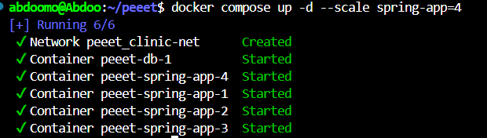
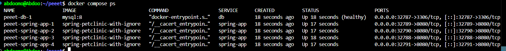
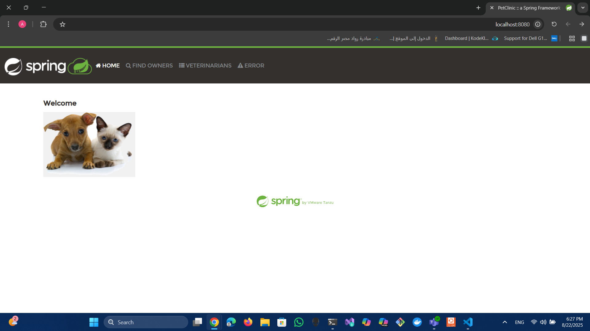

# DevOps Project: Docker & Container Orchestration

This project demonstrates the use of Docker Compose to manage and scale a multi-container application.

## Prerequisites
- Docker  
- Docker Compose  

---

## 1. Initial Deployment & Container Status
The first step involved running the Docker Compose setup. Despite a warning about a missing Dockerfile, the command successfully started the database container (`clinic-db`) and the application container (`spring-bit-clinic`).

```bash
docker compose up -d
```


---

## 2. Verifying the Running Containers
To check the status of all containers managed by the Docker Compose file, the following command was used:

```bash
docker compose ps
```

The output confirmed that both the database (`clinic-db`) and the application (`spring-bit-clinic`) were up and running.

---

## 3. Accessing the Application
The application was accessed successfully in a web browser. The URL `localhost:32775` indicated that the application was running, showing the "Welcome" page of the Spring PetClinic application.

---

## 4. Scaling the Application Service
To handle increased traffic, the application service was scaled up using the `--scale` flag. The following command started four separate instances of the `spring-app` container:

```bash
docker compose up -d --scale spring-app=4
```

---

## 5. Verifying the Scaled Containers
The following command was used again to confirm the scaling:

```bash
docker compose ps
```

The output showed one database container and four separate running instances of the `spring-app` container.

---

## 6. Accessing Scaled Services Through a Reverse Proxy
An additional Nginx container was introduced to act as a reverse proxy or load balancer. The following command verified the setup:

```bash
docker compose ps
```

The output confirmed that a single Nginx instance was running alongside the four scaled `spring-app` containers.

---

## 7. Final Application Access via Port 8080
The application was then accessed via `localhost:8080`. This demonstrated that the Nginx reverse proxy was correctly configured to listen on port 8080 and route requests to multiple application instances.



