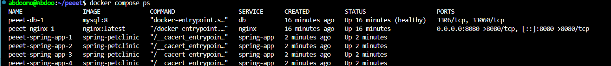

# DevOps Project: Docker & Container Orchestration
### Scaling Spring PetClinic with Docker Compose & Nginx Load Balanc

This project demonstrates how to use **Docker Compose** to deploy, scale, and manage a **multi-container Spring PetClinic application** with **MySQL** and **Nginx** as a reverse proxy/load balancer. It illustrates **container orchestration, horizontal scaling, traffic distribution, and observability**.

---

## Prerequisites
- Docker  
- Docker Compose  
- Basic understanding of containers and networking  

---

## 1. Initial Deployment & Container Status

Start the Docker Compose setup:

```bash
docker compose up -d
````

**Purpose:**

* Starts the **database container (`clinic-db`)** and the **application container (`spring-bit-clinic`)**.
* Ensures the basic system is running before scaling or load balancing.
* `-d` runs containers in detached mode (background).

📸 Example output:


---

## 2. Verifying the Running Containers

Check which containers are running:

```bash
docker compose ps
```

**Purpose:**

* Confirms that both the **database** and **application containers** are running correctly.
* Useful to verify if containers started without errors or crashed during initialization.

📸 Example output:


---

## 3. Accessing the Application

Open the application in a browser:

```http
http://localhost:32775
```

**Purpose:**

* Ensures the application is reachable from your host machine.
* Shows the Spring PetClinic “Welcome” page, confirming the app is connected to the database and running.

📸 Example output:


---

# Scaling Spring PetClinic with Docker Compose & Nginx Load Balancer 🐳

## 4. Scaling the Spring Application

To scale the application into multiple replicas:

```bash
docker compose -f docker-compose-replica.yml up -d --scale spring-app=5
```

**Explanation:**

* `docker compose` → Launch Docker Compose (v2).
* `-f docker-compose-replica.yml` → Use a Compose file designed for scaling.
* `up -d` → Start containers in detached mode.
* `--scale spring-app=5` → Run **5 replicas** of the Spring PetClinic application.

**Benefits:**

* Handles higher traffic efficiently.
* Provides redundancy: if one container fails, others continue serving requests.
* Demonstrates horizontal scaling in action.

⚠️ Note: Docker may warn that `version:` in the Compose file is obsolete — this is safe to ignore.

📸 Example output:


---

## 5. Verifying Running Containers

Check which containers are running:

```bash
docker compose ps
```

**Expected Output:**

* **db** → 1 MySQL container
* **spring-app** → 5 replicas (`spring-app-1 … spring-app-5`)
* **nginx** → 1 reverse proxy container

📸 Example output:


---

## 6. Nginx Reverse Proxy & Load Balancing

Nginx configuration:

```nginx
upstream spring_backend {
    server spring-app:8080;
}

server {
    listen 8080;

    location / {
        proxy_pass http://spring_backend;
        proxy_set_header Host $host;
        proxy_set_header X-Real-IP $remote_addr;
        proxy_set_header X-Forwarded-For $proxy_add_x_forwarded_for;
        proxy_set_header X-Forwarded-Proto $scheme;

        add_header X-Served-By $upstream_addr;
    }
}
```

**Purpose:**

* `upstream spring_backend` → Defines the pool of Spring replicas.
* `proxy_pass http://spring_backend` → Routes incoming requests to the upstream pool.
* `X-Served-By` → Custom header to identify which replica handled the request.
* Enables monitoring load distribution and debugging traffic routing.

📸 Nginx config screenshot:


---

## 7. Testing Load Balancing

Run multiple requests to observe load balancing:

```bash
for i in {1..30}; do curl -s -i http://localhost:8888 | grep X-Served-By; done
```

**Explanation:**

* `for i in {1..30}` → Sends 30 consecutive requests.
* `curl -s -i http://localhost:8888` → Queries the Nginx reverse proxy.
* `grep X-Served-By` → Shows only the header indicating which replica responded.

**Observation:**

* Requests are distributed among **different Spring replicas**.
* Confirms Nginx **load balances traffic** correctly.

📸 Example output:


**Sample `X-Served-By` responses:**

```
X-Served-By: 172.23.0.3:8080
X-Served-By: 172.23.0.4:8080
X-Served-By: 172.23.0.5:8080
X-Served-By: 172.23.0.6:8080
```

---

## 8. Final Result

* ✅ **5 Spring PetClinic replicas** running in parallel.
* ✅ **Nginx reverse proxy** distributes incoming traffic.
* ✅ **X-Served-By header** provides visibility into which replica processed each request.
* ✅ Demonstrates **scalability, redundancy, and load balancing** in a Docker environment.

